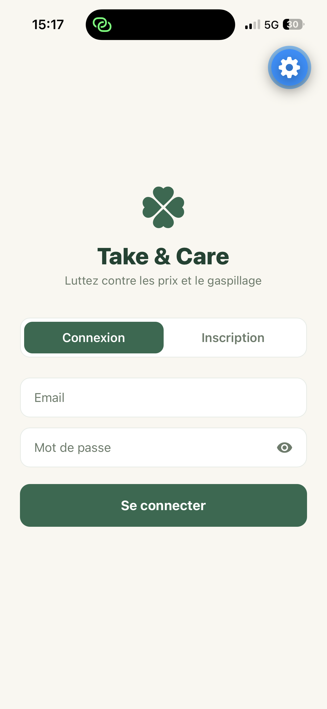
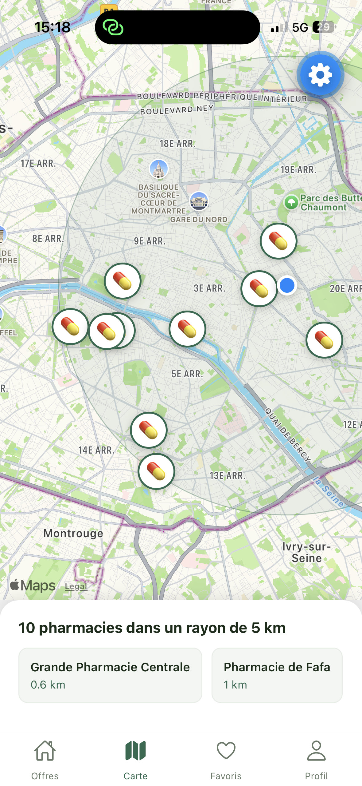
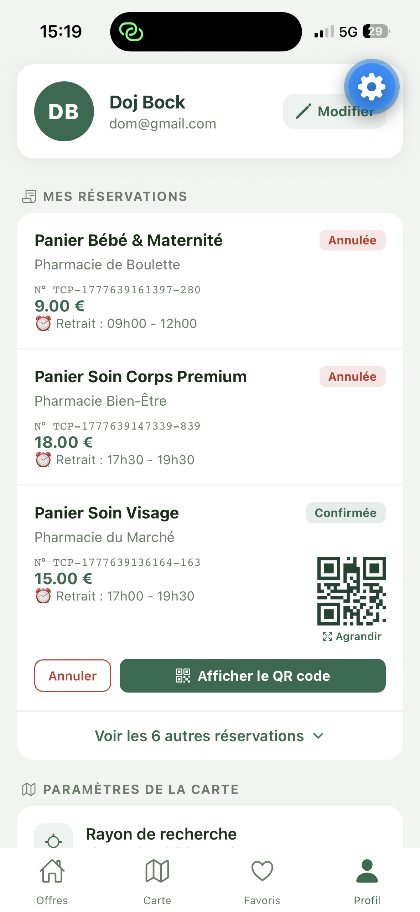

# TakeAndCare

> Application mobile anti-gaspillage qui permet aux pharmacies de vendre à prix réduit leurs cosmétiques proches de la date de péremption.


<p align="center">
  
  
  
  
</p>

## Le problème

Chaque année, les pharmacies jettent des produits cosmétiques encore parfaitement utilisables parce que leur date de péremption approche. TakeAndCare s'inspire du modèle de Too Good To Go : les pharmacies publient ces produits à prix réduit, les clients les réservent depuis l'application et viennent les récupérer en officine.

Le concept a été validé par des **entretiens avec des pharmaciens** portant sur la gestion de leurs stocks proches de la péremption et sur leurs conditions d'adoption d'un tel outil.

## Fonctionnalités

**Côté client**
- Catalogue de produits disponibles à prix réduit
- Carte interactive des pharmacies participantes
- Panier et réservation de produits
- Retrait en pharmacie grâce à un QR code

**Côté pharmacie**
- Tableau de bord de gestion des produits et des réservations
- Validation du retrait par scan du QR code client

L'application gère **deux rôles distincts** (client et pharmacie), chacun avec sa propre navigation et ses propres droits.

## Stack technique

| Domaine | Technologies |
|---|---|
| Framework mobile | React Native, Expo |
| Langage | TypeScript |
| Gestion d'état | Zustand |
| Navigation | React Navigation |
| Cartographie | Apple Maps |
| Backend | [ Firebase / Supabase / API maison / données simulées] |

## Architecture

```
src/
├── components/     # Composants réutilisables
├── screens/        # Écrans (client et pharmacie)
├── navigation/     # Navigation selon le rôle
├── store/          # Stores Zustand
├── services/       # Appels API et logique métier
└── types/          # Types TypeScript partagés
```

## Installation

Prérequis : Node.js 18+, npm, et l'application Expo Go sur ton téléphone (ou un émulateur).

```bash
git clone https://github.com/[ton-pseudo]/takeandcare.git
cd takeandcare
npm install
npx expo start
```

Scanne ensuite le QR code affiché dans le terminal avec Expo Go.

## Sécurité

Ce projet fait l'objet d'un **audit de sécurité** mené selon l'OWASP MASVS et la méthode STRIDE : modélisation des menaces, analyse statique du code et tests dynamiques (contrôle d'accès entre les rôles, robustesse des QR codes de retrait, stockage des données sensibles).

👉 Rapport complet : [takeandcare-security-audit](https://github.com/[ton-pseudo]/takeandcare-security-audit)

## Feuille de route

- [ ] Paiement en ligne avec Stripe
- [ ] Notifications push (nouveaux produits près de chez soi, rappel de retrait)
- [ ] Publication sur l'App Store et le Google Play Store
- [ ] Correction des vulnérabilités identifiées lors de l'audit

## Ce que j'ai appris

- Concevoir une application mobile complète avec deux parcours utilisateurs distincts
- Structurer la gestion d'état d'une application React Native avec Zustand
- Valider un besoin auprès de vrais utilisateurs avant de développer


